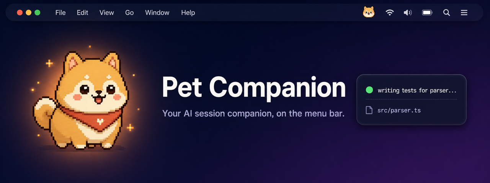

<p align="center">
  
</p>

<h1 align="center">Pet Companion</h1>

<p align="center">A macOS menu-bar companion that follows your Claude Desktop and Codex sessions.</p>

<p align="center">
  
  
  
  
  
  
</p>

---

**Pet Companion** sits in the macOS menu bar and renders a Codex-compatible desktop pet that mirrors the live state of your Claude Desktop and Codex sessions. Multi-session cards float above any app so you never miss when an AI is waiting on you. Click a card to jump straight to that session — drag the pet to detach, double-click to re-anchor.

## ✨ Features

- 🐾 **Animated desktop pet** with five states: `idle / running / waiting / waving / jumping`
- 🪟 **Multi-session cards** that float above any app and follow your active window
- 🎯 **Tracks both Claude Desktop & Codex** simultaneously — each app monitored independently
- 🔔 **Native macOS notifications** on state transitions (`waiting` / `waving`)
- 🖱 **One-click focus** — click a card to jump to the matching Claude or Codex window
- 🪄 **Custom Codex pets** loaded directly from `~/.codex/pets`
- 📌 **Drag to detach** or double-click to re-anchor to the active window
- ⚙️ **Per-app watch toggles**, pet size slider, and right-click hide


## 🚀 Requirements

- **macOS 13** (Ventura) or later
- **Accessibility permission** _(recommended)_ — enables window-anchoring and one-click focus via AppleScript
- **Notifications permission** _(optional)_ — surfaces state-change alerts when sessions go `waiting` or `waving`

## 📦 Installation

### Pre-built bundle

Grab the latest `Pet Companion.app` from the [Releases](https://github.com/terajh/pet-companion/releases) page and drop it into `/Applications`.

### From source

```bash
pnpm install
pnpm tauri build --debug
```

The debug bundle is written to:

```
src-tauri/target/debug/bundle/macos/Pet Companion.app
```

## 🛠 Development

```bash
pnpm install
pnpm tauri dev                                       # run the app with hot reload
pnpm test                                            # vitest unit tests
cargo check --manifest-path src-tauri/Cargo.toml     # Rust type-check
```

## ⚙️ Configuration

Open the **Settings** window from the tray menu to adjust:

| Option | Description |
|--------|-------------|
| **Pet size** | Scale the pet from `0.5×` to `2.0×` |
| **Watch Claude / Watch Codex** | Toggle per-app session tracking independently |
| **Pet override** | Pick any Codex custom pet under `~/.codex/pets`, or fall back to `bori` |

Right-click the pet for the in-overlay shortcut to **Hide pet** — re-show it from the menu-bar tray icon.

## 🗺 Roadmap

- ✅ **macOS state-transition notifications** _(shipped in v0.1.38)_
- 🟡 Pet collection & multi-slot UI
- 🟢 Status-aware action hints on session cards
- 🟢 Daily session statistics dashboard

See [`docs/STRATEGY.md`](docs/STRATEGY.md) for the full competitive gap analysis and roadmap rationale.

## 📄 License

Released under the [MIT License](LICENSE).
